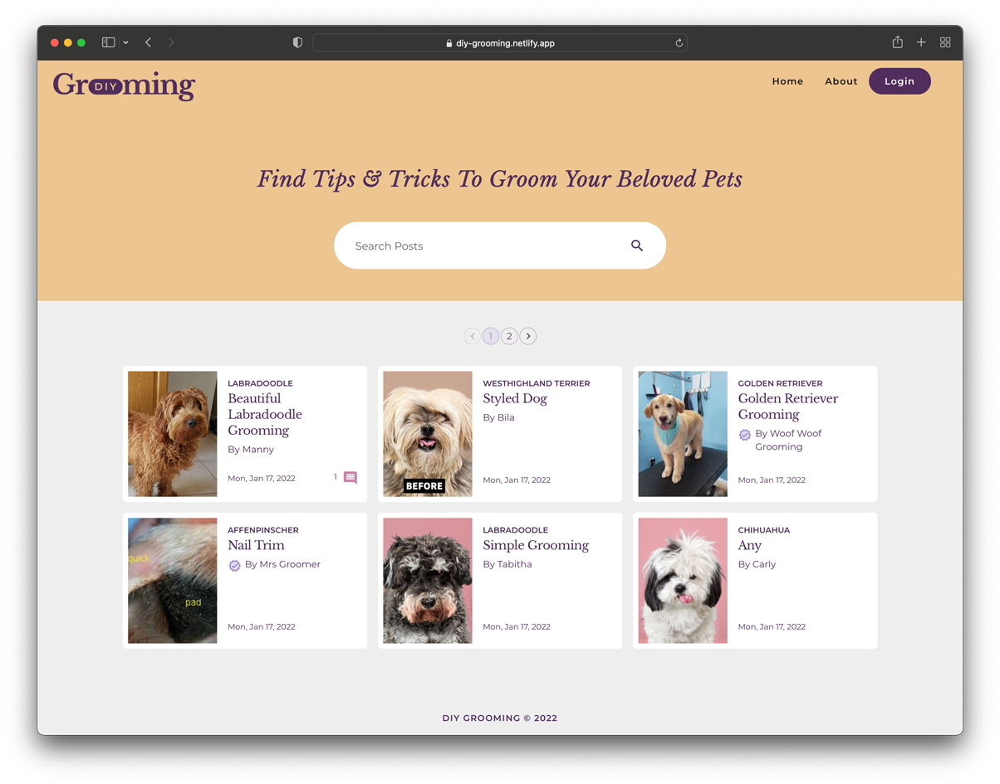
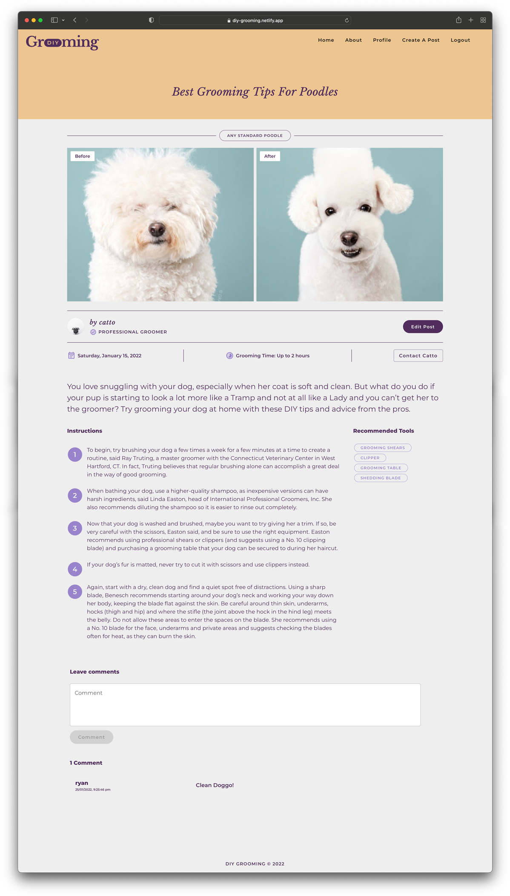

# DIY Grooming

Coder Academy FX1 Melbourne 2021 final project –– a team collaboration to create a full-stack web application.

## About the project

The Notting Hill neighbourhood management approached us to help them create an online blog dedicated to dog owners in the community.

The online blog is a platform to share and find step-by-step DIY dog grooming instructions. The Notting Hill neighbourhood community and anyone interested in DIY dog grooming can access the blog. Additionally, professional groomers can contribute and promote their services, and when needed, registered users can then contact them through the blog.

 &darr;  Project repositories can be found below:

---

## Deployed Website

> 👉🏻   [**diy-grooming.netlify.app**](https://diy-grooming.netlify.app)

## Screenshots

&darr;  Home or landing page

&darr;  Create a new post form for registered users

&darr;  Single post page

## Workflow

We utilised the GitHub organisation to create a central 💦🐩✨ [DIY Grooming](https://github.com/DIYGrooming) repository for our team workflow. As a result, all members have access to better manage the separate sub-repositories (micro-sites) and help organise the full-stack project for team collaboration.

## Project Details & Microsites

 &darr;  Please check Part A for more information about the project and planning process.

### Part A – Planning & Detailed Documentations

🗂 Documentations  →  [DIY Grooming Docs](https://github.com/DIYGrooming/docs)

### Part B – Development & Production

🏭  Server Side - Backend  →  [DIY Grooming Backend](https://github.com/DIYGrooming/server-backend)  

🖥  Client Side - Frontend  →  [DIY Grooming Frontend](https://github.com/DIYGrooming/client-frontend)  

---

## Responsibilities

In the initial stage, I helped set up the initial project repositories suitable for team collaboration, such as utilising extra configuration for code-linters and format on save configuration (e.g., `prettier.rc`) to enforce code formatting consistency. As a team of four members, three of us, including me, are mainly responsible for looking after the front-end side.

Being the only graphic designer, I also took the opportunity to create some high-fidelity wireframes to help other members visualise the design and provide guidance in styling. In addition to that, I managed to develop the global styling and theme for the blog to enforce style consistency and achieve a cohesive look.

## ✨ Personal Reflection

#### Communication & Limited Individual Skills

Communication has been the most challenging aspect of our team collaboration. However, despite our limited individual skills and various personal circumstances, we worked well together and put up the current blog version on deployment! Indeed, there are still many improvements to be made. Some features have not been successfully implemented yet due to time constraints. 

#### No-SQL Database

Using `MongoDB` as a no-SQL database system (through `Mongoose`) for the first time was not as challenging as using `PostgreSQL` in Ruby on Rails. This is because the database queries and manipulations are pretty much the same as working with objects in JavaScript. However, I find the "strictness" in the relational database that often causes various alerts upon wrong implementations is somewhat helpful to ensure that the database implementations are correct (I think I miss that from my previous [*marketplace project*](https://github.com/a-sh-dev/rails_pawsomes)). I would love to do another project to utilise MongoDB as the database (especially working on the backend for the setup and configuration).

#### Enjoyable Parts & Known Issues

The most enjoyable part for me was creating reusable dynamic components and figuring out conditional rendering that can help improve the UI and UX on displaying data. Moreover, implementing `Material UI` or `MUI` has been enjoyable, too, despite the hiccups here and there when other non-standard-text field components are used on the main form (create a post form). 

Unfortunately, at this stage, I failed to successfully implement the complete `CRUD` operations for the post (missing the update and delete implementations). Hopefully, I can revisit the issues and fix them as soon as possible!

Few significant issues that I want to improve and be better at after submitting this project:

- Unit testing or test-driven development (`TDD`) is the primary thing that we as a team want to improve and be good at, as, unfortunately, we're unable to implement it.

- Better states management for both local and global (especially `Redux`) as I tried to split some main components into smaller sub-components to enforce cleaner code and components reusability. For example, for the main `Create a post` form, I split it into the `Details` section and `Steps` or `Instructions` section.  For reference, please refer to the screenshot above.

- Improve the site performance by fixing any memory leaks due to possible expensive API calls for loading the fetched data.

- Explore a better form-management in React, such as utilising `React-hook-form` for form validations and integrating `Firebase` with the backend for automatic image uploads–so that the user doesn't have to finalise or upload photos first before publishing the post. These issues will improve the overall UX.

- Finally, working on this project made me want to explore JavaScript more, mainly the DOM, to improve my understanding of how things (actually) work in React. 

Nevertheless, it has been a hugely rewarding ***"learning by doing"*** experience. As a team, we decided to build a MERN project––a stack that we didn't formally learn at the boot camp. We used various external sources to build the project (thanks to YouTube). Moreover, *kanban* project management and team collaboration, especially `Git` and `Discord`, have also been precious learning experiences. 
